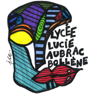

# Bienvenue au lycée Lucie AUBRAC

Une présentation du lycée qui aidera à remplacer les JPO.

De manière virtuelle, vous pouvez découvrir les locaux, les enseignements et obtenir quelques renseignements utiles sur l'ENT ou l'intendance de l'établissement.

## ATRIUM

[ATRIUM](https://www.atrium-sud.fr/) est l'ENT du lycée, il permet
- de se connecter automatiquement à `pronote`,
- d'avoir accès à un espace de stockage personnel de travail,
- d'avoir accès à la messagerie interne du lycée,
- d'avoir accès aux sites collaboratifs des enseignants,
- et bien d'autres choses encore.

## Administration

### Direction

TODO: Mme Rodrigues et/ou M. Vinatier... un petit mot...

### Vie Scolaire

TODO: Olivier... un petit mot...

## Enseignements de spécialité

En plus du tronc commun, le lycée offre des spécialités parmi ses enseignements :

- Arts plastiques
- ... (je ne connais pas la liste précise...)
- Mathématiques
- NSI
- Physique, Chimie
- SVT

--8<-- "includes/abbreviations.md"
